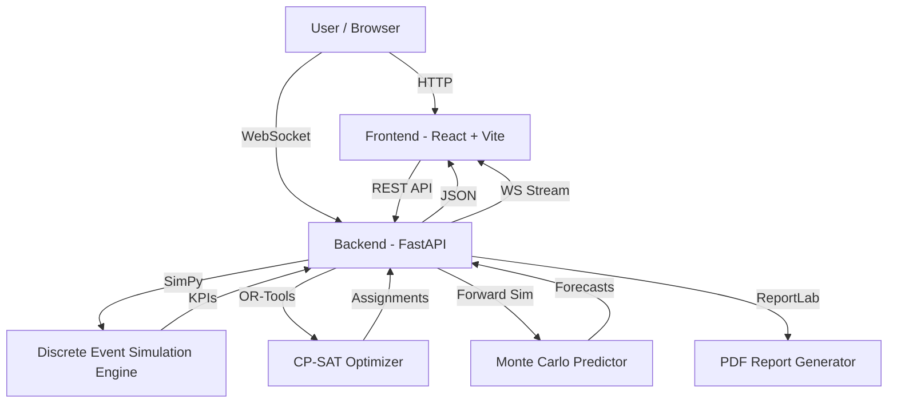

# Architecture

## System Architecture

## Components

| Component | Technology | Responsibility |
|---|---|---|
| Frontend Dashboard | React 18 + TypeScript + Vite | 8-page SPA with KPI cards, charts, maps, scenario controls |
| Backend API | FastAPI (Python 3.12) | 12 REST endpoints + 1 WebSocket endpoint, request routing |
| Simulation Engine | SimPy 4.x | Discrete event simulation of vessel arrivals, berthing, crane ops |
| Optimizer | Google OR-Tools CP-SAT | Integer constraint optimization for berth/crane assignment |
| Forward Predictor | Custom Monte Carlo | Multi-trajectory simulation for congestion forecasting |
| Shift Planner | Custom builder | 72-hour shift generation with work orders and contingencies |
| PDF Generator | ReportLab 4.x | Executive summary PDF with tables and formatted sections |
| Live Stream | WebSocket (FastAPI) | Real-time simulation state streaming with speed control |
| Scenario Manager | Singleton service | Multi-scenario lifecycle: generate, compare, switch, delete |

## Data Flow

1. **Scenario Generation**: User selects parameters (vessels, berths, cranes, duration) → system generates randomized scenario data
2. **Simulation Run**: SimPy engine processes vessel arrivals chronologically → computes berth assignments, wait times, queue lengths
3. **KPI Computation**: Baseline KPIs computed from simulation results (avg wait, P95 wait, berth util, demurrage cost)
4. **Optimization**: CP-SAT solver assigns vessels to berths with crane allocations minimizing total wait + demurrage
5. **Forward Prediction**: Monte Carlo simulator runs N forward trajectories → identifies hotspots and vessel-level forecasts
6. **Rerouting**: Recommender evaluates each vessel's wait time vs. alternative port transit + congestion → suggests diversions
7. **Shift Planning**: 72-hour window divided into 8-hour shifts → work orders assigned based on optimized schedule
8. **Frontend Display**: React pages fetch data via REST, charts render with Recharts, map shows vessel positions

## Security Considerations

- No authentication implemented (hackathon scope)
- All data is synthetic/generated — no real port data
- API keys and secrets handled via environment variables
- CORS configured for local development
- No database — all state held in memory via singleton services

## Scalability Notes

- Backend is stateless per-request (FastAPI async)
- Simulation engine is CPU-bound but can be parallelized across scenarios
- CP-SAT solver has configurable time limits (default 2s) for real-time responsiveness
- WebSocket supports multiple concurrent clients
- Frontend is a static SPA — easily deployable to Vercel/Netlify
